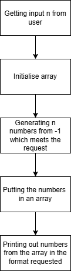

- Name: Martin Xu
- Student ID: S2786186
- Tutorial group: 07
- Tutor: Shlok Gupta
- Date: 2026-03-10


# Superstitious-hotel-elevator #

# Target audience #

People who has done a small amount of programming and can understand basic java.

# Prerequisite knowledge #

Understands basic java syntax of if-statements, for loops, while loops.

# Learning outcomes #
- Understand the syntax of basic java arrays<br>
- be able to use arrays to store numbers<br>
- be able to construct a simple program using for loops, while loops, if statements and arrays to solve the challenge 


# 1.Introduction #
The purpose of this worksheet is to guide the reader through solving the code golf problem-superstitious-hotel-elevator in java. Concepts of selection, iteration and array manipulation will be used to solve this problem.
<br>The challenge requests:Read a positive even integer n from STDIN, representing the number of floors, and print what the button layout would look like to STDOUT: -1, followed by the next n-1 positive integers that aren't equal to 13 and don't contain digit 4. Arrange these numbers in two columns such as in the above image: print two floor numbers per line, separated by a horizontal tab, so that reading the lines in reverse order from left-to-right yields the sequence in ascending order.
<br>To simplify, you are given an input n, and you need to print out n numbers in pairs starting from -1 which are not 13 and does not contain the number 4.
# 2.Problem abstraction #
This problem can be broken down into many smaller, easier subproblems.<br>
- Getting the input number n from user
- initialising an array
- generating the first n numbers which are not 13 and does not contain 4
- put those numbers in the array
- print out the numbers in pairs in order
<br>

However, the main two parts are getting the n valid button numbers and print them out.
<br>Let's first look at obtaining the n numbers.<br>
In this case we would want to be using a while loop to generate the numbers, with a condition with in the loop checking whether the number meets the requirements.Since we don't actually know how many
repeats it will take us to generate n numbers.<br>
Now we would want to put them into an array in order, don't worry about implementations of arrays for now(covered next section), you just need to know they are
data structures which can hold multiple variables of the same type, and they can be retrieved and manipulated once stored.
<br>so we can now have some pseudocode for this part:
<pre>
take input of total buttons needed - total_buttons
initialise array with size of total_buttons
initialise generated = 0(indicating how many number have been generated)
initialise current_number to be 1(there are no 0 for the buttons)
while generated < total buttons needed:
    if current number is not 13 && doesn't contain 4: 
        add current number to array
        increment generated
    increment current number
</pre>
So after generating the numbers, we now need to print them out in the formatted way.<br>
we can now use a for loop, because we know how many numbers we need to print out, and hence the number of repeats, as 
we are printing two numbers at once, so total_buttons/2 loops needed.<br>

# 3.Introduction to arrays in java #
Why Do We Need Arrays?<br>
In our elevator problem, we need to find all valid floor numbers first, but print them in reverse order. We can't print as we find them, so we need to store the numbers for later. Arrays are perfect for this!<br>

What is an Array?<br>
An array is a container that holds multiple values of the same type, arranged in order. Think of it like a row of numbered boxes:
<pre>
Index:   [0]    [1]    [2]    [3]    [4]
Value:   -1     1      2      3      5
</pre>
Array Syntax in Java<br>
Declaring and Creating:<br>
```java
int[] numbers;              // declare an array variable
numbers = new int[5];       // create array with 5 spaces

// Or in one line:
int[] numbers = new int[5]; // declare AND create
```
Note that when arrays are initialised, they are filled with default values of the type declared.<br>
In this case Int is declared hence the array is filled with the default value of Integer class, which is 0<br>
Accessing Elements:<br>
```java
numbers[0] = -1;            // set value at index 0
numbers[1] = 1;             // set value at index 1
int x = numbers[1];         // get value from index 1 (x is now 1)
```
Key Properties of arrays:<br>
- Zero-based indexing: first element is at index 0, last at length-1
- Fixed size: array size can't change after creation
- length property: numbers.length gives the array size (5 in this example)
<br>
Here is an example of how to loop through an array using a for loop, which we will do later:<br>
```java
// Fill an array using a loop
int[] numbers = new int[5];
for (int i = 0; i < numbers.length; i++) {
    numbers[i] = i * 10;    // numbers becomes [0, 10, 20, 30, 40]
}
```
# 4. Implementation of solution #
Hopefully now, you have a solid understand of basic array syntax in java and how to access and manipulate array items at an index.<br>
So let's now jump in and start implementing our solution!<br>
first, let's initialise all the variables we need:
```java
Scanner scanner = new Scanner(System.in);
int total_buttons = scanner.nextInt();
int[] valid_buttons = new int[total_buttons];
valid_buttons[0] = -1;
int current_index = 1;
int current_num = 1;
```
Don't worry about the scanner too much, it is just a way to get a number from the user typing and to store it in a variable, in this case total_button<br>
The array valid_buttons stores all the button numbers which are generated by our while loop, which satisfy the conditions stated in the problem, we set the first item to be -1 as it is fixed.<br>
The number current_index tracks how many valid button numbers have already been logged, and is also the index of the next space of the array to asserting the next number, it is incremented after each valid number is asserted into the array<br>
The number current_num tracks the current number being checked whether it is a valid button number, it is incremented each loop<br>
Now let's look at out while loop for generating the numbers:
```java
// looping and putting numbers which are valid into the button array
        // the loop stops when the array is full, meaning requested amount of buttons have been filled
        while (current_index != total_buttons){
            // if number is not 13 and does not contain 4, then it is a valid button and will be put into the array
            if ( current_num != 13 && !Integer.toString(current_num).contains("4")){
                valid_buttons[current_index] = current_num;
                current_index += 1;
            }
            // increment the current number by 1 after each check
            current_num += 1;
```
Other parts of the loop should be rather straight forward, we are checking all numbers starting from 1 and if they satisfy the condition to be a button number, then it is asserted into valid_buttons, making the array sorted increasingly.<br>
The most difficult part must be the condition inside the if-statement, let's look at that closely:<br>
```java
if ( current_num != 13 && !Integer.toString(current_num).contains("4"))
```
The condition has two parts, connected by a && operator, meaning AND in logic. This means both of the sub conditions on either side of && must be true for the overall condition to be true.<br>
The first part, current_num!=13 should be easy, it is just saying "the current number being checked is not 13".<br>
The second part first uses a function from the Integer class called 'toString', which simply converts a integer to a String,
```java
//example of how Integer.toString work:
System.out.println(Integer.toString(120))//gives "120" in string form
```
<br> then uses a function from the String class called "contains" which checks if the converted string has the digit "4" in it

```java
//example of how .contains work
System.out.println("120".contains("4"))//false, as 120 doesn't have the digit 4
System.out.println("124".contains("4"))//true, as 124 does containt the digit 4
```
So essentially this is just checking whether the integer current_num has the digit 4 in it.
notice there is a "!" in front of the second statement, which negates the condition.<br>
so, overall, this line means:<br>
if the current number is not 13, and 4 is not one of its digits, then proceed and execute the statement inside the if-statement.
Now that we have implemented the generation of those numbers, it is time to print them.
Look at the example output for input 14:
<pre>
15 16
11 12
9 10
7 8
5 6
2 3
-1 1
</pre>
Notice the pattern:

- Two numbers per line, separated by a tab
- The numbers are printed in pairs from the end of our array moving backwards
When you read the lines from bottom to top, left to right, you get: -1, 1, 2, 3, 5, 6, 7, 8, 9, 10, 11, 12, 15, 16<br>

If our valid_buttons array contains: [-1, 1, 2, 3, 5, 6, 7, 8, 9, 10, 11, 12, 15, 16]<br>
We need to access elements in this order:
- First line: indices 12 and 13 (15 and 16)
- Second line: indices 10 and 11 (11 and 12)
- Third line: indices 8 and 9 (9 and 10)
And so on...
<br> 
We need a loop that:
- Starts at the last pair (second-to-last element)
- Prints two elements at a time
- Moves backwards by 2 each time
- Stops when we've printed all pairs
As it is explicitly mentioned in the problem, the input will be guaranteed to be even, so we can safely print 2 elements at once without having to worry about array index overflow.<br>
Let's look at our implemented loop:<br>
```java
// total_buttons is the array length (14 in the example)
for (int i = total_buttons-2; i >=0;i -=2){
            System.out.println(Integer.toString(valid_buttons[i]) + "  " + Integer.toString(valid_buttons[i+1]));
        // Print element at i and i+1 with a tab between them
        }
```
Let's check if the index works properly:
<pre>
For total_buttons = 14:

First iteration: i = 12 → prints indices 12 and 13 (15 and 16)

Second iteration: i = 10 → prints indices 10 and 11 (11 and 12)

Third iteration: i = 8 → prints indices 8 and 9 (9 and 10)

And so on until i = 0 → prints indices 0 and 1 (-1 and 1)
</pre>
So let's now put the two parts together and produce a finished solution:<br>
```java
public static void main(String[] args){
        Scanner scanner = new Scanner(System.in);
        int total_buttons = scanner.nextInt();
        int[] valid_buttons = new int[total_buttons];
        valid_buttons[0] = -1;
        int current_index = 1;
        int current_num = 1;
        // looping and putting numbers which are valid into the button array
        // the loop stops when the array is full, meaning requested amount of buttons have been filled
        while (current_index != total_buttons){
            // if number is not 13 and does not contain 4, then it is a valid button and will be put into the array
            if ( current_num != 13 && !Integer.toString(current_num).contains("4")){
                valid_buttons[current_index] = current_num;
                current_index += 1;
            }
            // increment the current number by 1 after each check
            current_num += 1;
        }
        // printing out the numbers in pairs as requested from biggest to smallest
        for (int i = total_buttons-2; i >=0;i -=2){
            System.out.println(Integer.toString(valid_buttons[i]) + "  " + Integer.toString(valid_buttons[i+1]));
        }

    }
```
And now for an optional refraction, we can put the main algorithm into a method, leave the input part in the main method and give as an argument for our algorithm:<br>
```java
import java.util.Scanner;

public class CodeGolf {
    public static void elevator(int total_buttons){
        int[] valid_buttons = new int[total_buttons];
        valid_buttons[0] = -1;
        int current_index = 1;
        int current_num = 1;
        // looping and putting numbers which are valid into the button array
        // the loop stops when the array is full, meaning requested amount of buttons have been filled
        while (current_index != total_buttons){
            // if number is not 13 and does not contain 4, then it is a valid button and will be put into the array
            if ( current_num != 13 && !Integer.toString(current_num).contains("4")){
                valid_buttons[current_index] = current_num;
                current_index += 1;
            }
            // increment the current number by 1 after each check
            current_num += 1;
        }
        // printing out the numbers in pairs as requested from biggest to smallest
        for (int i = total_buttons-2; i >=0;i -=2){
            System.out.println(Integer.toString(valid_buttons[i]) + "  " + Integer.toString(valid_buttons[i+1]));
        }

    }
    public static void main(String[] args) {
        Scanner scanner = new Scanner(System.in);
        int num = scanner.nextInt();
        elevator(num);
    }
}
```

# Testing # 
Now let's test our program against some test cases to see if it works as intended:<br>
Test1<br>
input 
<pre>2</pre>
expected output:
<pre>-1	1</pre>
Test2<br>
input
<pre>14</pre>
expected output:
<pre>
15	16
11	12
9	10
7	8
5	6
2	3
-1	1
</pre>
Test3<br>
input
<pre>36</pre>
expected output:
<pre>
39	50
37	38
35	36
32	33
30	31
28	29
26	27
23	25
21	22
19	20
17	18
15	16
11	12
9	10
7	8
5	6
2	3
-1	1
</pre>
Test4<br>
input
<pre>100</pre>
expected output:
<pre>
120 121
118 119
116 117
113 115
111 112
109 110
107 108
105 106
102 103
100 101
98  99
96  97
93  95
91  92
89  90
87  88
85  86
82  83
80  81
78  79
76  77
73  75
71  72
69  70
67  68
65  66
62  63
60  61
58  59
56  57
53  55
51  52
39  50
37  38
35  36
32  33
30  31
28  29
26  27
23  25
21  22
19  20
17  18
15  16
11  12
9   10
7   8
5   6
2   3
-1  1
</pre>



# Original challenge question from CodeGolf #

[Short link to CodeGolf challenge](https://codegolf.stackexchange.com/q/68866 "tooltip text")

Here's a very superstitious hotel elevator in Shanghai:

An elevator's button panel, missing the number 13.

It avoids the number 13, because thirteen is unlucky in the Western world, and it avoids the digit 4, because four is unlucky in parts of Asia. What if this hotel was taller?

Read a positive even integer n from STDIN, representing the number of floors, and print what the button layout would look like to STDOUT: -1, followed by the next n-1 positive integers that aren't equal to 13 and don't contain digit 4. Arrange these numbers in two columns such as in the above image: print two floor numbers per line, separated by a horizontal tab, so that reading the lines in reverse order from left-to-right yields the sequence in ascending order. (You may optionally print a trailing newline character, too.)

Test cases
For the input 14, output should be as in the above image:

15  16<br>
11  12<br>
9   10<br>
7   8<br>
5   6<br>
2   3<br>
-1  1<br>
where the whitespace in each line is a single horizontal tab character.

For the input 2, you should print -1  1.

For the input 100, you should print:

120 121<br>
118 119<br>
116 117<br>
113 115<br>
111 112<br>
109 110<br>
107 108<br>
105 106<br>
102 103<br>
100 101<br>
98  99<br>
96  97<br>
93  95<br>
91  92<br>
89  90<br>
87  88<br>
85  86<br>
82  83<br>
80  81<br>
78  79<br>
76  77<br>
73  75<br>
71  72<br>
69  70<br>
67  68<br>
65  66<br>
62  63<br>
60  61<br>
58  59<br>
56  57<br>
53  55<br>
51  52<br>
39  50<br>
37  38<br>
35  36<br>
32  33<br>
30  31<br>
28  29<br>
26  27<br>
23  25<br>
21  22<br>
19  20<br>
17  18<br>
15  16<br>
11  12<br>
9   10<br>
7   8<br>
5   6<br>
2   3<br>
-1  1<br>


<STYLE>
* { /* Don't leave any empty lines or IntelliJ might not render correctly */
  /* Text size */
  font-size:   1.1rem;
  /*font-size:   1.2rem;*/
  /* Zenburn dark theme */
  background-color: #2A252A;
  color:            #D5DAD5;
  /* One Dark theme */
  /*background-color: #282C34;
  color:            #ABB2BF;*/
  /* white-ish on dull blue-ish */
  /*background-color: DarkSlateGray;
    color:            AntiqueWhite;*/
  /* white on black */
  /*background-color: black;
  color: white;*/
  /* black on white */
  /*background-color: white;
  color: black;*/
  /* nearly black on bright yellow */
  /*background-color: #FFFFAA;
  color:            #080808;*/
  /* black on bright blue */  
  /*background-color: #99CCFF;
  color:            black;*/
}
body {
  /* width of the text column */
  width: 80%;
  /* line spacing */
  line-height: 180%;
  /*line-height: 200%;*/
  /* Font styles: */
  /* Default sans serif */
  /*font-family: sans-serif;*/
  /* Default serif */
  font-family: serif;
  /* Specific font with generic fall-back */
  /* font-family: "Calibri Light", sans-serif; */
  /*font-family: "OpenDyslexic", sans-serif;*/
}
pre,
code,
pre code {
  /* line spacing */
  line-height: 150%;
  /* Default monospace */
  font-family: monospace;
  /* Specific fixed-width font with generic fall-back */
  /*font-family: "Consolas", monospace;*/
  /*font-family: "OpenDyslexicMono", monospace;*/
}
ol,
ol ol,
ol ol ol { /* Nested lists all use decimal numbering */
  list-style-type: decimal;
}
em {
  /* if you want underlining instead of italics */
  /*font-style: normal;
  border-bottom-style: solid;
  border-bottom-width: 1px;
  padding-bottom:      2px;*/
  text-decoration-skip-ink: auto;
}
h2 { /* Put a horizontal line above major headings to assist screen viewing */
  border-top:  1px solid #D5DAD5;
  margin-top:  80px;
  padding-top: 20px;
  }
</STYLE>